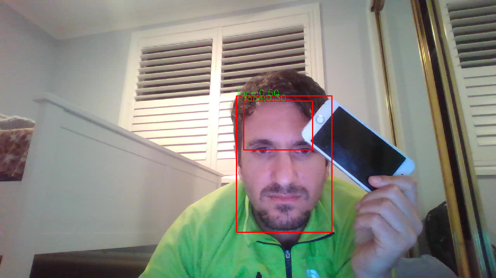

# yolov7_opencv_cpp
Object Detection using YOLOv7 and OpenCV DNN C++

### Get repo and install dependences
```bash
git clone --recursive https://github.com/majnas/yolov7_opencv_cpp.git
cd yolov7_opencv_cpp/yolov7

# Install dependencies.
pip install -r requirements.txt
pip install onnx
```


### Prepare custom weight
Download my custom yolov7 face detection using this cmd 
```shell
cd cfg/training/
wget --load-cookies /tmp/cookies.txt "https://docs.google.com/uc?export=download&confirm=$(wget --quiet --save-cookies /tmp/cookies.txt --keep-session-cookies --no-check-certificate 'https://docs.google.com/uc?export=download&id=1INiC_M_ttd8xMpZ9CuSA1FTqUxZT4e1y' -O- | sed -rn 's/.*confirm=([0-9A-Za-z_]+).*/\1\n/p')&id=1INiC_M_ttd8xMpZ9CuSA1FTqUxZT4e1y" -O custom_weight.pt && rm -rf /tmp/cookies.txt
```

Or place use your own custom yolov7 weight in following folder.

```shell
└── yolov7
    ├── cfg
    │   ├── baseline
    │   ├── deploy
    │   └── training
    │       ├── custom_weight.pt           <----- Place the custom weight here
    │       ├── yolov7-d6.yaml
    │       ├── yolov7-e6e.yaml
    │       ├── yolov7-e6.yaml
    │       ├── yolov7-tiny.yaml
    │       ├── yolov7-w6.yaml
    │       ├── yolov7x.yaml
    │       └── yolov7.yaml

```


* Make a copy of yolov7/cfg/deploy/yolov7.yml and rename to yolov7_custom_weight.yaml then change number of class in line number 2 (nc=1). For my custom weight there is only one class (face).
```shell
cd ..
cp deploy/yolov7.yaml deploy/yolov7_custom_weight.yaml
# edit yolov7_custom_weight.yaml => Set nc in line 2 => nc=1 in my case which I have only one class 
```
* Moving reparameterization_yolov7.py to yolov7 directory.
```shell
# In root of repo directory
mv reparameterization_yolov7.py ./yolov7/reparameterization_yolov7.py
# Edit./yolov7/reparameterization_yolov7.py  
# 1 - Set number of classes
# nc=1 # change this base on number of classes in your custom model
# 2 - Set device
# device = select_device('0', batch_size=1) # if using GPU
# device = select_device('cpu', batch_size=1) # if using CPU 
```

### Reparameterization of model
```shell
cd ./yolov7
python reparameterization_yolov7.py
``` 
> :warning: **If you are using different version of yolov7 (yolov7x, yolov7-tiny, ...) use different reparameterizatioin script from [here](https://github.com/WongKinYiu/yolov7/blob/main/tools/reparameterization.ipynb) **: Be very careful here!

This will create another model (custom_weight_reparameterized.pt) in cfg/deploy/custom_weight_reparameterized.pt, which is reparameterized version of custom weight.

```shell
└── yolov7
    ├── cfg
    │   ├── baseline
    │   ├── deploy
    │   │   ├── custom_weight_reparameterized.pt   <------------- Reparameterized custom weight 
    │   │   ├── yolov7_custom_weight.yaml    
    │   │   ├── yolov7-d6.yaml
    │   │   ├── yolov7-e6e.yaml
    │   │   ├── yolov7-e6.yaml
    │   │   ├── yolov7-tiny-silu.yaml
    │   │   ├── yolov7-tiny.yaml
    │   │   ├── yolov7-w6.yaml
    │   │   ├── yolov7x.yaml
    │   │   └── yolov7.yaml
    │   └── training
    │       ├── custom_weight.pt                  <------------- Custom weight
    │       ├── yolov7-d6.yaml
    │       ├── yolov7-e6e.yaml
    │       ├── yolov7-e6.yaml
    │       ├── yolov7-tiny.yaml
    │       ├── yolov7-w6.yaml
    │       ├── yolov7x.yaml
    │       └── yolov7.yaml

```

### Export to ONNX
To export ONNX we have to checkout to u5 branch, and export reparameterized version of custom weight to onnx and torchscript, to do this
```shell
git checkout u5
python export.py --weights cfg/deploy/custom_weight_reparameterized.pt --topk-all 100 --iou-thres 0.65 --conf-thres 0.35 --img-size 640 640
```
Now we will have onnx and tochscript version of our custom_weight.pt
```shell
└── yolov7
    ├── cfg
    │   ├── deploy
    │   │   ├── custom_weight_reparameterized.onnx           <------------- onnx version
    │   │   ├── custom_weight_reparameterized.pt             <------------- Reparameterized custom weight
    │   │   └── custom_weight_reparameterized.torchscript    <------------- torchscript version version
    │   └── training
    │       └── custom_weight.pt             <------------- Custom weight

```

### To compile and run cpp version
```bash
# In root of repo directory
cd cpp
mkdir build
cd build
cmake ..
make
./app "../../data/me.jpeg" "../../yolov7/cfg/deploy/custom_weight_reparameterized.onnx" 640 640
```

:information_source: If you got following error, you must install [opencv](https://github.com/opencv/opencv) on your system.
```
CMake Error at CMakeLists.txt:7 (find_package):
  By not providing "FindOpenCV.cmake" in CMAKE_MODULE_PATH this project has
  asked CMake to find a package configuration file provided by "OpenCV", but
  CMake did not find one.

  Could not find a package configuration file provided by "OpenCV" with any
  of the following names:

    OpenCVConfig.cmake
    opencv-config.cmake

  Add the installation prefix of "OpenCV" to CMAKE_PREFIX_PATH or set
  "OpenCV_DIR" to a directory containing one of the above files.  If "OpenCV"
  provides a separate development package or SDK, be sure it has been
  installed.
```

<div align="center">
  
</div>
<p align="center">
  Figure 1: cpp prediction for me_cpp_pred.png
</p>
