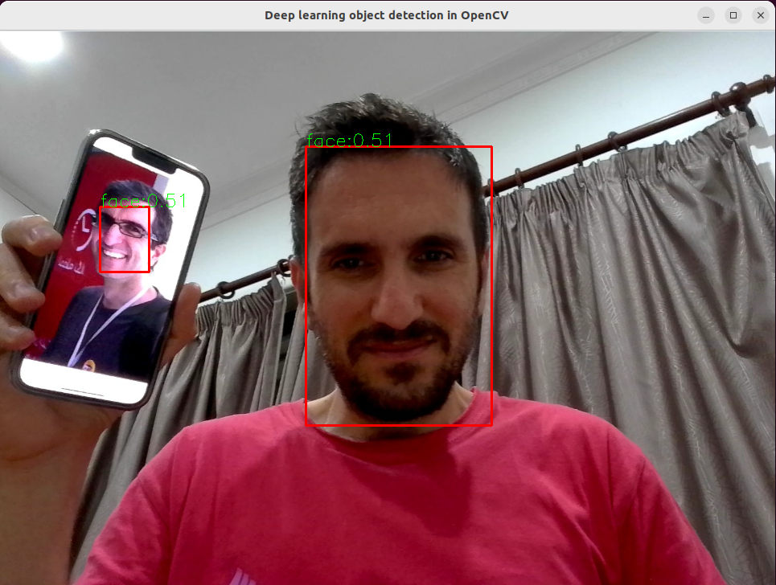

# yolov7_opencv_cpp
Object Detection using YOLOv7 and OpenCV DNN C++


```bash
git clone --recursive https://github.com/majnas/yolov7_opencv_cpp_python.git
cd yolov7_opencv_cpp/yolov7

# Install dependencies.
pip install -r requirements.txt
pip install onnx

# Download .pt model.
cd models
wget https://github.com/ultralytics/YOLOv5/releases/download/v6.1/YOLOv5s.pt

# Export to ONNX.
cd ..
python export.py --weights models/YOLOv5s.pt --include onnx
```

# To compile and run cpp version
```bash
    cd cpp
    mkdir build
    cd build
    cmake ..
    make     
    ./app
```

<!-- <div align="center">
  
</div>
<p align="center">
  Figure 2: cpp prediction for me.png
</p> -->
